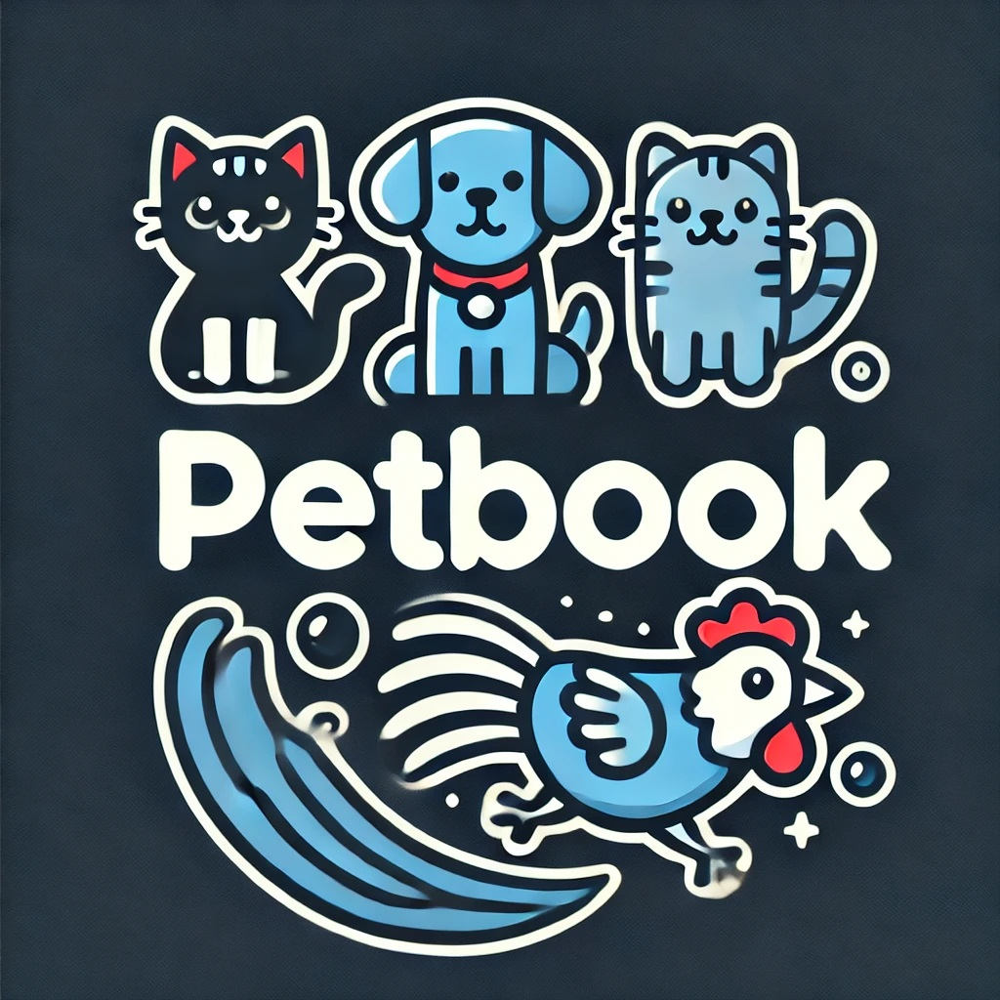
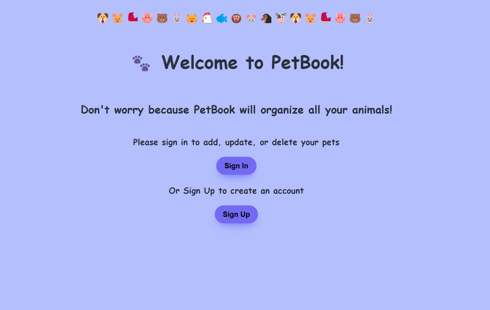
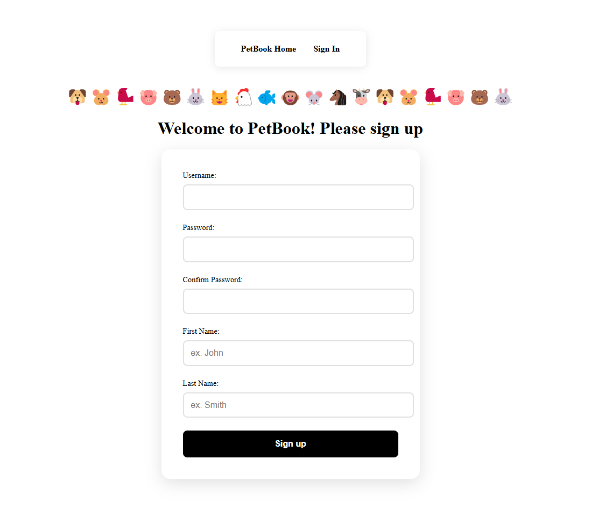
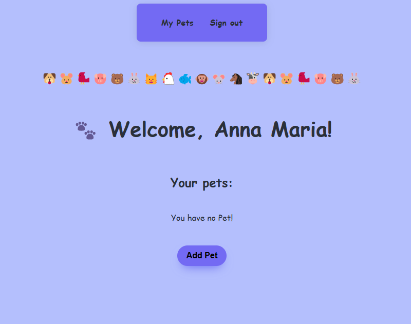
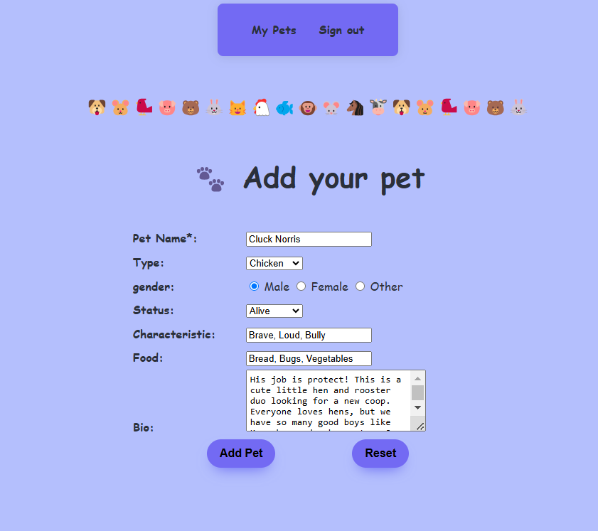
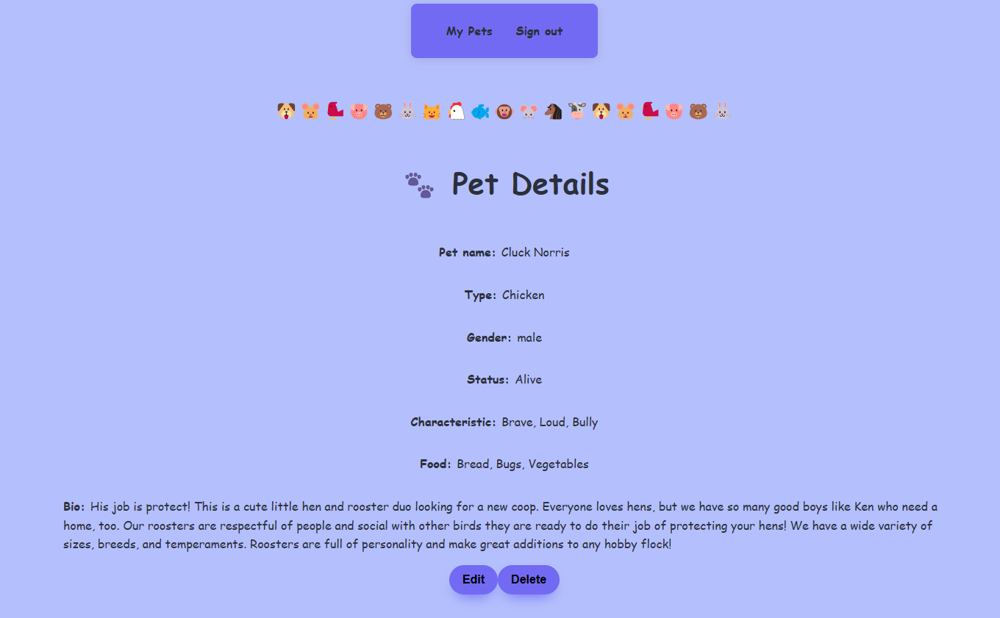
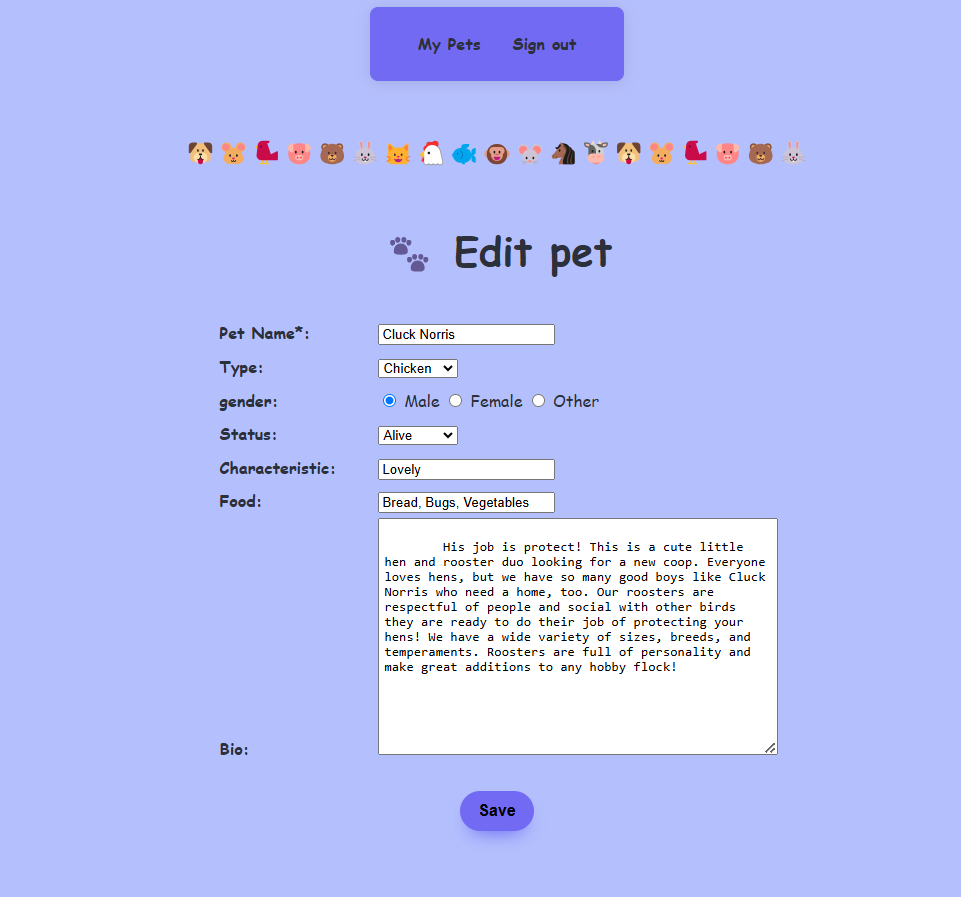

Screenshot/Logo: A screenshot of your app or a logo.
Your app’s name: Include a description of your app and its functionality. Background info about the app and why you built it is a nice touch.
Getting started: Include a link to your deployed app and a link to your planning materials.
Attributions: This section should include links to any external resources (such as libraries or assets) you used to develop your application that require attribution. You can exclude this section if it does not apply to your application.
Technologies used: List of the technologies used, for example: JavaScript and any major frameworks or libraries.
Next steps: Planned future enhancements (stretch goals).

# PetBook

## We all love animals
####  We all love animals, whether we live on a farm, in a house, or in an apartment, we all have/had pets. Especially if you have a petshop, animal shelter or often become foster parents. Let's document them in PetBook!

#### Below is the page to register and create an account. Simply enter your username, password and first and last name.

### Once logged in, you can add animals as well as edit or delete them.

## Getting started:

Here are the links on the PetBook project:

Project planning link: https://trello.com/invite/b/67b0a19160d144685e39531d/ATTI481e9632311c0f6afb40d896b0fdb65bF33B3568/petbook-project

GitHub repo link: https://github.com/yunus-h/petbook.git

Deployed project link: https://petbook-j4lvwo77k-yunus-projects-7d6e95be.vercel.app/

First sign up for registration if you don't already have an account. Enter your username, password, firstname and last name. Then login to access my pets list. You can add, edit and delete your pets on the 'My Pets' page.

The following are the details of the pet data: 

Pet Name : String
Type : Selection of the animal type (Bird/Cat/Chicken/Cow/Dog/Duck/Fish/Horse/Pig/Rabbit/etc)
Gender : Selection of the pet gender (Male/Female/Other)
Status: Selection of the pet status (Alive/Dead/Missing/Unknown)
Characteristic: String
Food: String
Bio: String

## Attributions: 

https://trello.com/
https://www.npmjs.com/
https://vercel.com/
https://developer.mozilla.org/
https://www.google.com/

## Technologies used:

JavaScript, HTML, CSS, Express, MongoDB, EJS, NodeJS, NPM, GitHub

## Next steps:

The current PetBook is very simple. But there are some steps that can make PetBook even better. 

Adding detailed data on users, such as email, address, hobbies, and so on.

Adding detailed data on the pet, such as birthday, color, veterinarian, grooming salon, and so on.

PetBook would be great if there were pictures on user profiles, as well as on animal profiles. Also if all users in PetBook can connect with each other, and also see pictures and stories of their pets.

